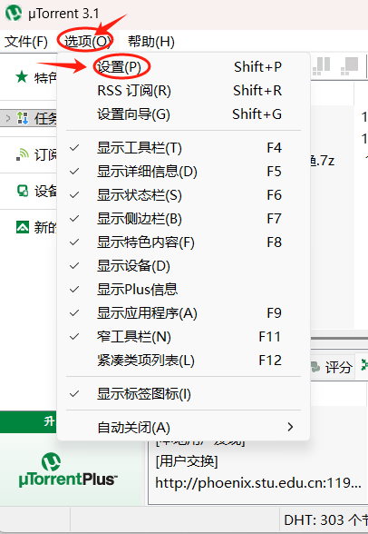
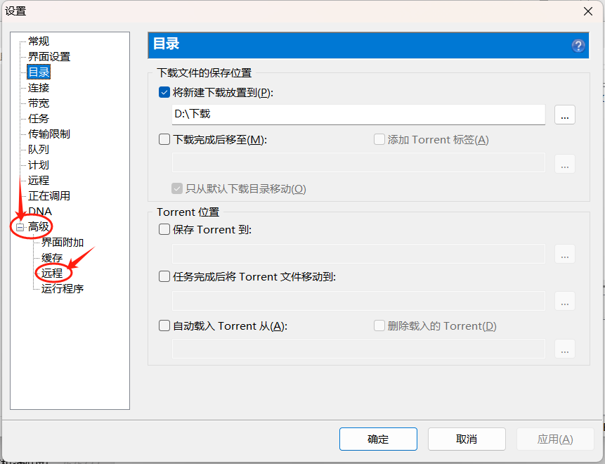
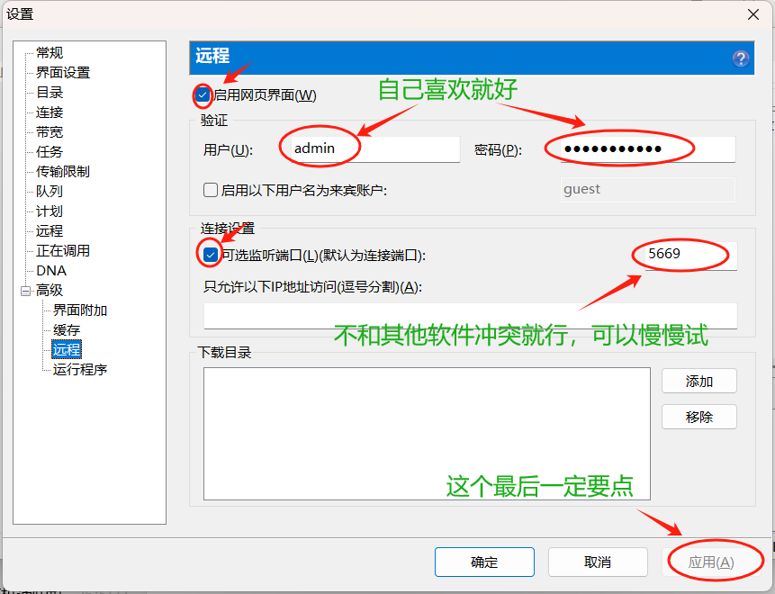
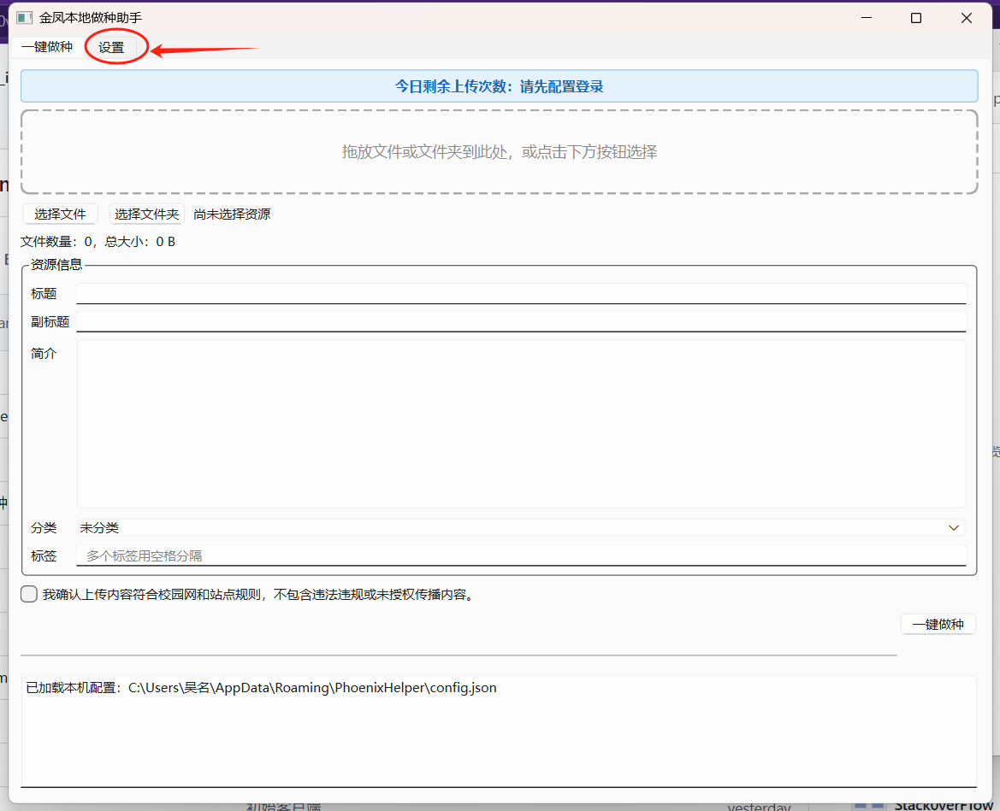
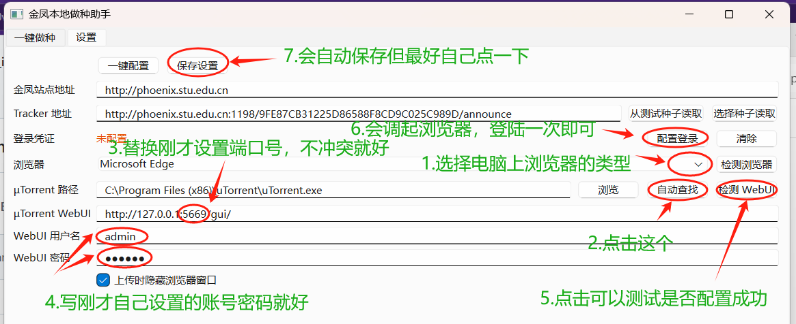
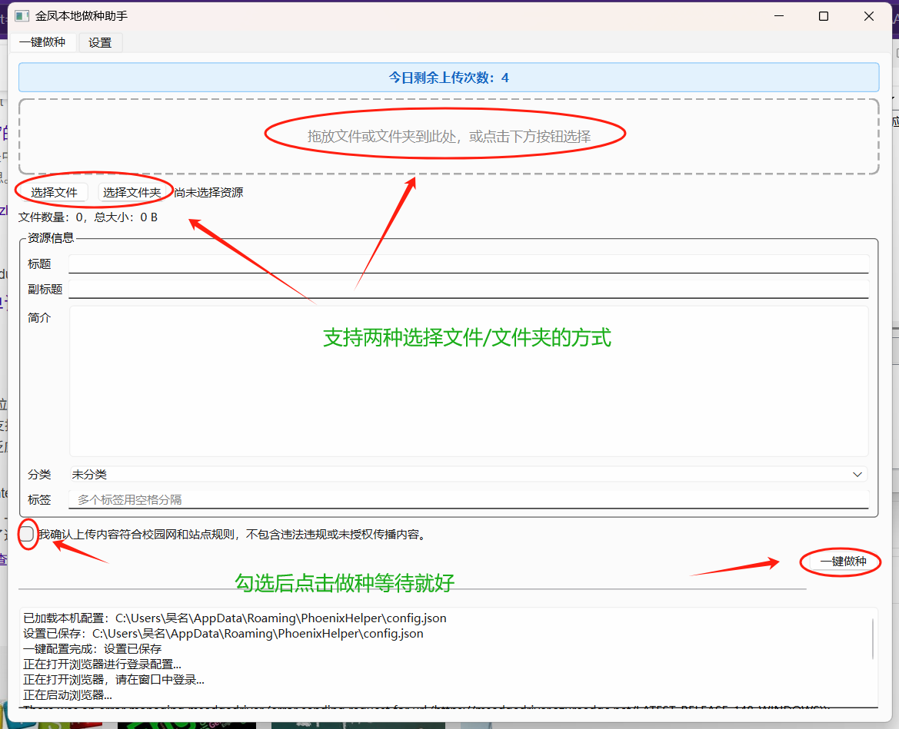

# 金凤本地做种助手

一键完成制种、上传到金凤 PT 站、下载官方种子、调用 µTorrent 做种。

## 功能

- 选择文件或文件夹，自动生成 .torrent 种子
- Selenium 自动化上传到金凤网站（支持 Edge / Chrome / Firefox）
- 自动下载站点返回的官方种子
- 调用 µTorrent 打开种子做种
- 显示每日剩余上传次数
- 支持无头模式（后台上传，不弹出浏览器窗口）

## 快速开始

### 1. 下载

从 `dist/` 目录获取打包好的程序：

- `phoenix-helper.exe` — 单文件版本（66MB，首次启动可能较慢）
- `phoenix-helper-dir/` — 文件夹版本（启动更快，推荐）

### 2. 首次配置

**µTorrent 配置**：

​	





1. 点击 **自动查找**（会搜索常见安装路径）
2. 找不到时手动选择 `uTorrent.exe`
3. 如使用 WebUI，填写地址（默认 `http://127.0.0.1:8080/gui/`）和账号密码

打开程序后，进入 **设置** 页面：







**浏览器配置**：

1. 选择浏览器（推荐 Edge，系统自带无需额外安装）
2. 点击 **检测浏览器** 验证驱动是否可用
3. 首次使用会自动下载对应驱动（需联网）

**登录金凤**：

1. 点击 **网页登录**
2. 在弹出的浏览器窗口中完成学校账号登录
3. 登录成功后点击 **保存登录状态**
4. 助手只保存站点 Cookie，不保存学校账号密码

**Tracker 地址**：

- 已预设默认值，无需修改

### 3. 使用方法

1. 在 **一键做种** 页面选择文件或文件夹（支持拖放）
2. 确认标题、简介等信息（自动填充，可手动修改）
3. 点击 **开始上传**
4. 等待完成，µTorrent 会自动打开种子做种

## 配置文件位置

```text
%APPDATA%\PhoenixHelper\config.json
```

浏览器登录状态保存在：

```text
%APPDATA%\PhoenixHelper\selenium_profile\
```

## 从源码运行

```bash
# 创建虚拟环境
python -m venv .venv
source .venv/Scripts/activate  # Windows: .venv\Scripts\activate

# 安装依赖
pip install -e .[dev]

# 运行
python -m phoenix_helper.app
```

## 打包

使用干净的 Python 环境打包（避免 Anaconda OpenSSL 问题）：

```bash
# 自动创建 .build-venv 并打包
python scripts/build_windows_clean.py

# 或在已有的干净虚拟环境中直接打包
python scripts/build_windows.py
```

打包选项：

- `--onefile`：单文件 exe（默认）
- `--onedir`：文件夹模式（启动更快）
- `--windowed`：无控制台窗口（默认）

## 常见问题

### 启动时提示"另一程序正在使用此文件"

Windows Defender 实时扫描导致。解决方案：

1. 打开 **Windows 安全中心** → **病毒和威胁防护** → **管理设置**
2. 在 **排除项** 中添加程序所在文件夹
3. 或使用 `phoenix-helper-dir/` 文件夹版本（启动更快，不易触发）

### 浏览器驱动检测失败

- Edge：系统自带，通常无需额外安装
- Chrome：需要安装 Chrome 浏览器
- Firefox：需要安装 Firefox 浏览器

首次检测时会自动下载对应驱动，需保持联网。如下载失败，可手动下载放入 `scripts/drivers/` 目录。

### 上传次数显示为 0

每日上传次数在上传成功后自动减一。显示为 0 时仍可尝试上传（数据可能不同步）。

## 技术栈

- Python 3.12 + PySide6
- Selenium WebDriver（Edge / Chrome / Firefox）
- PyInstaller 打包

## 注意事项

- 不要提交 `config.json`、Cookie、密码等敏感信息
- `.gitignore` 已覆盖常见本地文件，提交前请检查 `git status`
- 学校统一认证可能有验证码或风控，推荐使用浏览器登录方式
